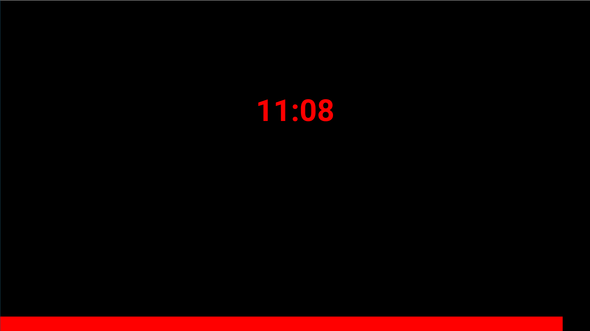

# Countdown template for Caspar CG

------
## Install
Download or git clone. Put the folder into the caspar server templates directory.

------

## Usage

Insert either the `countdown` or `end_at` key value pair into the template variables of this template in the CapsarCG client.
* Press F2 to start countdown. 
* Press F1 to stop and hide the countdown.
* Press F6 to update template variables without hiding the countdown.

------

## Caspar template variables
| Key        | Default           | Description  |
| ------------- |:-------------| -----|
| countdown      | 600 | Countdown in  total seconds or hh:mm:ss format. 10 Minutes = `600` or `00:10:00`  |
| end_at      |  | End countdown at dateString. `countdown` key will be ignored. Format: `April 13, 2020 18:30:00`  |
| font-size     | 40      |   Font size in pixels |
| color | blue      |    CSS color properties. HEX, RGB, RGBA, HSL, HSLA etc.  |
| elapsed_text |    |    Text when countdown is finished |
| top |   0   |    Position top offset in pixels |
| bar-visible |   false   |    Show progression bar |
| bar-color |   blue   |    Progression bar CSS color |
| bar-height |   35   |    Progression bar height in pixels |
| bar-position |   bottom   |    Progression bar position bottom or top |

------

## Change font
The default font is Roboto Bold. To change the font add the font file into the fonts folder.
Open the index.html file and change the path of `src: url('fonts/Roboto/Roboto-Bold.ttf');` 

------
Have fun!
[My twitter](https://twitter.com/altoar)